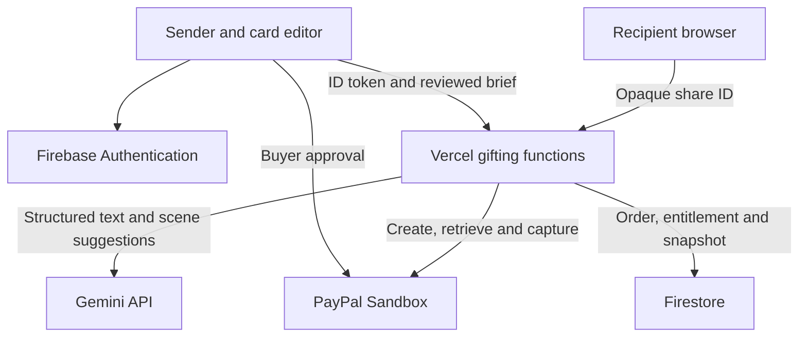

# Ultra Cards architecture

```mermaid
flowchart TD
  Sender["Sender and card editor"]
  Auth["Firebase Authentication"]
  API["Vercel gifting functions"]
  Gemini["Gemini API"]
  PayPal["PayPal Sandbox"]
  DB["Firestore"]
  Recipient["Recipient browser"]
  Sender --> Auth
  Sender -->|"ID token and reviewed brief"| API
  Sender -->|"Buyer approval"| PayPal
  API -->|"Structured text and scene suggestions"| Gemini
  API -->|"Create, retrieve and capture"| PayPal
  API -->|"Order, entitlement and snapshot"| DB
  Recipient -->|"Opaque share ID"| API
```

Free card links carry only the finished card in a URL fragment. The premium route returns a server-published snapshot using a randomly generated link ID.
